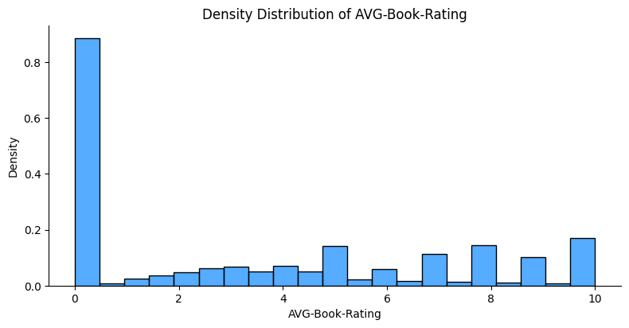
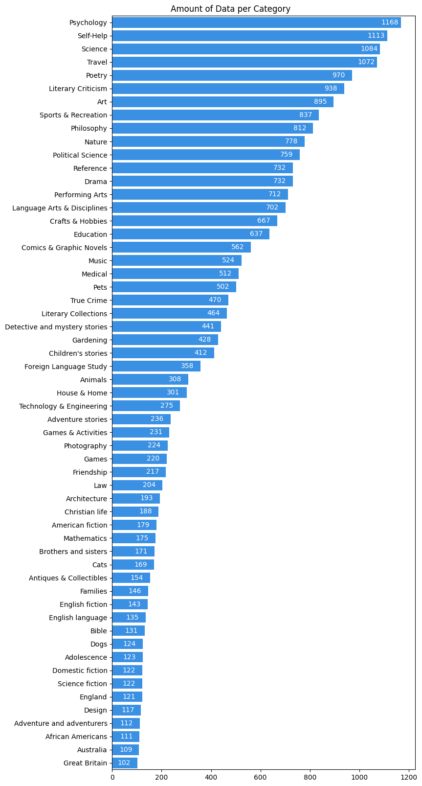
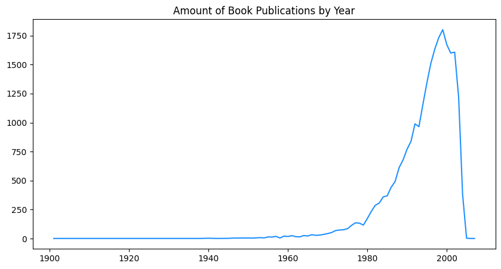

# Book Recommendation System with Content Based Filtering

## Project Overview

\
*Image Credit: DALL-E*

Membaca buku adalah salah satu kegiatan yang bermanfaat bagi perkembangan otak dan pengetahuan. Buku dapat membuka wawasan, menginspirasi, dan memberikan informasi yang berguna bagi pembacanya. Namun, tidak semua orang memiliki minat atau kesempatan untuk membaca buku. Ada banyak faktor yang dapat menghambat kebiasaan membaca, seperti kurangnya waktu, motivasi, atau akses terhadap buku yang sesuai dengan selera dan kebutuhan[1].

Untuk meningkatkan minat dan kesempatan membaca buku terutama yang memiliki masalah terhadap akses terhadap buku yang sesuai dengan selera dan kebutuhan, **machine learning** dapat digunakan untuk mengembangkan sistem rekomendasi, yaitu sistem yang dapat memberikan saran atau pilihan kepada pengguna berdasarkan preferensi, perilaku, atau karakteristik mereka. Sistem rekomendasi dapat membantu meningkatkan minat baca dengan cara merekomendasikan buku-buku yang relevan, menarik, dan sesuai dengan keinginan pengguna[2].

## Business Understanding

### Problem Statements

Berdasarkan pada ringkasan proyek di atas, terdapat masalah yang ditemukan yaitu, kurangnya minat pembaca buku dikarenakan beberapa faktor salah satunya sulit mendapat buku yang sesuai minat, oleh karena itu sebuah sistem perlu dikembangkan untuk dapat memberikan sebuah rekomendasi buku yang sesuai terhadap preferensi dan karakteristik buku yang dijadikan sebagai acuan.

### Goals

proyek ini bertujuan untuk membuat sebuah sistem yang dapat memberikan rekomendasi buku. di harapkan dengan adanya sistem ini, minat dalam membaca buku pada sebagian orang akan tumbuh karena mempunyai pilihan yang tepat untuk buku yang mungkin disukainya. 

### Solution Statements

Solusi yang diberikan dalam proyek ini adalah dengan membuat sistem rekomendasi dengan pendekatan *machine learning* dan menggunakan teknik *content based filtering*. Setiap prediksi rekomendasi diharapkan memiliki metrik yang dapat diukur tingkat ketepatannya.

## Data Understanding & Preparation

### Informasi data

*Dataset* yang digunakan diambil dari situs *kaggle* bernama [Book-Crossing: User review ratings](https://www.kaggle.com/datasets/ruchi798/bookcrossing-dataset), *dataset* ini di informasikan berisi 278.858 pengguna (anonim tetapi dengan informasi demografis) yang memberikan 1.149.780 *rating* (eksplisit / implisit) tentang 271.379 buku. 

Semua data ini dibagi menjadi 3 dataset berbeda tetapi saling berhubungan yaitu *BX_Books.csv*, *BX-Users.csv*, dan **BX-Book-Ratings.csv*, namun pada proyek ini akan menggunakan 2 yaitu *BX_Books.csv* dan *BX-Book-Ratings.csv*, namun dengan 1 *dataset* tambahan dari sumber yang sama yaitu *Preprocessed_data* yang akan diambil fitur di dalamnya berupa *ISBN* dan *Category*.

Atribut pada *BX_Books.csv*, selanjutkan akan disebut dengan variabel *book*:
- **ISBN**: identifikasi unik secara internasional terhadap satu buku
- **Book-Title**: judul buku
- **Book-Author**: penulis asli buku
- **Year-Of-Publication**: tahun terbit buku
- **Publisher**: penerbit buku
- **Image-URL-S**: cover sampul ukuran kecil
- **Image-URL-M**: cover sampul ukuran sedang
- **Image-URL-L**: cover sampul ukuran besar

Tabel 1. Informasi Data pada Variabel *book*

| Attribute           |	Data Type |	Null Count | Null %	| Unique Count |
| ------------------- | --------- | ---------- | ------ | ------------ | 
| ISBN                | object	  | 0          | 0      | 271379       |
| Book-Title          | object    | 0          | 0      | 242154       |
| Book-Author         | object    | 1          | 0      | 102028       |
| Year-Of-Publication | object    |	0          | 0      | 202          |
| Publisher           |	object    | 2          | 0.001  | 16806        |
| Image-URL-S         |	object    | 0          | 0      | 271063       |
| Image-URL-M         |	object    | 0          | 0      | 271063       |
| Image-URL-L         |	object    | 1          | 0      | 271062       |

Atribut pada *BX-Book-Ratings.csv*, selanjutkan akan disebut dengan variabel *rating*:
- **User-ID**: identifikasi unik dari user yang memberikan *rating*
- **ISBN**: identifikasi unik secara internasional terhadap satu buku
- **Book-Rating**: *rating* dari buku dengan skala 1-10 (0 berarti belum di beri *rating*)

Tabel 2. Informasi Data pada Variabel *rating*

| Attribute           |	Data Type |	Null Count | Null %	| Unique Count |
| ------------------- | --------- | ---------- | ------ | ------------ | 
| User-ID             | int64 	  | 0          | 0      | 105283       |
| ISBN                | object    | 0          | 0      | 340556       |
| Book-Rating         | int64     | 0          | 0      | 11           |

Atribut pada *Preprocessed_data.csv*, selanjutkan akan disebut dengan variabel *category*:
- **ISBN**: identifikasi unik secara internasional terhadap satu buku
- **Category**: kategori dari buku

Tabel 3. Informasi Data pada Variabel *category*

| Attribute           |	Data Type |	Null Count | Null %	| Unique Count |
| ------------------- | --------- | ---------- | ------ | ------------ | 
| ISBN                | object	  | 0          | 0      | 270170       |
| Category            | object    | 0          | 0      | 6448         |

### Menghapus fitur yang tidak diperlukan

Proyek ini hanya memerlukan data yang berhubungan langsung terhadap informasi suatu buku. Untuk mencapai hal tersebut, perlu dilakukan penghapusan pada kolom yang tidak dibutuhkan. berikut beberapa kolom yang dihapus:

1. Variabel *book*
    - **Image-URL-S, Image-URL-M, Image-URL-L**: berisi tautan yang berisikan gambar sampul buku, tidak membantu dalam proses pemodelan kecuali jika gambar tersebut diekstraksi informasi dan fitur darinya. tetapi proses pengenalan gambar tidak dilakukan disini.
1. Variabel *ratings*
    - **User-ID**: identifikasi unik dari user, tidak berhubungan dengan informasi buku.

### Menangani kesalahan entri data

Terdapat beberapa kesalahan entri data yang ditemukan, yaitu pada kolom *Year-Of-Publication*. kesalahan entri data tersebut perlu dibetulkan agar analisis dapat dilakukan dengan benar. beberapa kesalahan entri data tersebut, yaitu:
- Nilai pada baris yang bergeser ke kolom sebelahnya misal terdapat kolom a b c, namun kolom a b terisi data b c, sedangkan kolom c kosong.
- pada kolom tahun, terdapat nilai 2037 dimana itu tidak mungkin, asumsi terdapat kesalahan penulisan sehingga data tersebut diubah menjadi 2007.
- pada kolom tahun, terdapat nilai 0 dan '0' dimana itu tidak mungkin, asumsi tahun terbit tidak diketahui, penyelesaiannya nilai tersebut akan diubah menjadi *nan*.

### Menghitung nilai rata-rata dari rating

Karena model pada proyek ini menggunakan *content based* bukannya *collaborative*, nilai dari rating hanya akan digunakan sebagai urutan dari referensi buku yang direkomendasikan, fitur *rating* akan di kalkulasi menggunakan *mean* sehingga dapat di ambil nilai rata-ratanya.

### Menggabungkan data Book, Category, data Ratings

Model yang dikembangkan hanya menggunakan 1 sumber data, maka dari itu semua data yang telah disebutkan sebelumnya yaitu *book*, *rating*, dan *category* akan digabungkan menjadi satu sehingga dapat digunakan pada model yang dikembangkan. Penggabungan dilakukan berdasarkan data yang tersedia pada data *book* berdasarkan pada fitur *ISBN* yang merupakan nomor identifikasi buku yang digunakan.

### Menangani data yang hilang

Nilai yang kosong atau tidak tersedia dapat membuat model bias atau bahkan tidak berjalan sebagaimana mestinya, maka dari itu langkah penanganan nilai tersebut perlu dilakukan untuk menghindari hal tersebut. berikut dapat dilihat pada tabel 4, fitur mana dan jumlah nilai yang kosong.

Tabel 4. Nilai yang tidak tersedia pada setiap atribut/fitur

| Atribut             | Jumlah |
| ------------------- | ------ |
| ISBN                | 0      |
| Book-Title          | 0      |
| Book-Author         | 1      |
| Year-Of-Publication | 4619   |
| Publisher           | 2      |
| Category            | 1209   |
| AVG-Book-Rating     | 1209   |

Baris pada kolom *Year-Of-Publication*, *Category*, *AVG-Book-Rating* akan lanngsung dihapus karena jumlahnya sedikit jika dibandingkan dengan keseluruhan data yang ada, hasilnya dari 271379 menjadi 265572 setelah baris kosong pada ketiga kolom tersebut dihapus. Untuk baris pada kolom *Book-Author* dan *Publisher* akan langsung diisi dengan nilai '*Unknown*' karena data tersebut tidak banyak dan nilai sebenarnya memang tidak diketahui.

### Menangani data duplikat

Data duplikat dapat terjadi dalam kumpulan data karena kesalahan entri data, masalah pengumpulan data, atau masalah pemrosesan data. Mengidentifikasi dan menangani catatan duplikat penting untuk memastikan keakuratan dan konsistensi analisis pada data. 

pada data yang digunakan, tidak ditemukan satupun data yang duplikat, maka dalam hal ini tidak ada yang perlu di tangani.

### Memperbaiki kesalahan tipe data

Tipe data yang salah dapat mengganggu tahap analisis, sistem yang dapat secara otomatis menghasilkan banyak hal akan dapat salah dalam membacanya jika terdapat kesalahan pada tipe data ini, berikut dapat dilihat pada tabel 5, tipe data pada data yang telah digabung sebelumnya.

Tabel 5. Tipe data pada setiap atribut/fitur

| Atribut             | Tipe Data |
| ------------------- | --------- |
| ISBN                | object    |
| Book-Title          | object    |
| Book-Author         | object    |
| Year-Of-Publication | object    |
| Publisher           | object    |
| Category            | object    |
| AVG-Book-Rating     | object    |

Tipe data pada atribut Year-Of-Publication yang berisi tahun terbitnya buku akan diubah menjadi tipe data *integer*, hal ini dilakukan karena atribut ini akan dilakukan analisis nantinya dan tidak memerlukan tipe data *datetime*. Tidak ada masalah untuk sisa tipe data pada atribut lainnya.

### Membersihkan teks pada kategori

Sebelum melanjutkan proses pada tahap ini, perlu diketahui bahwa pada kolom *category* memiliki *noise* atau dianggap kotoran pada setiap nilainya, berikut contoh *noise* yang disebutkan:

- ['Fiction']
- ["Children's stories, English"]

Dapat di lihat bahwa terdapat simbol yang tidak dibutuhkan di awal dan akhir pada setiap data kategori, simbol ini akan dihilangkan menggunakan fungsi *regex*, fungsi ini akan mencari karakter yang sesuai berdasarkan variabel yang telah diatur. Dapat di lihat pada tabel 6, perbedaan pada kategori yang kotor dan bersih.

Tabel 6. Perbedaan kategori kotor dan bersih

| kotor                | bersih           |
| -------------------- | ---------------- |
| ['Fiction']          | Fiction          |
| ['Juvenile Fiction'] | Juvenile Fiction |
| ['Religion']	       | Religion         |
| ['Emotions.']        | Emotions.        |

### Menangani data yang tidak biasa

Pada analisis yang dilakukan ditemukan bahwa terdapat nilai 9 pada kolom *category*, data ini memiliki 128052 data yang berarti memiliki presentase sebesar 48.217%, asumsi maksud dari nilai 9 ini adalah *None* atau *NaN* atau nilai yang kosong atau tidak tersedia, proyek ini membutuhkan nilai kategori yang sesuai agar dapat berjalan sebagaimana mestinya, maka dari itu semua baris yang memiliki nilai tersebut pada kolom *category* akan dihapus sepenuhnya.

### Menghapus kategori yang memiliki jumlah data per kategori <100 dan ≥1400

Setelah sistem berjalan, ditemukan bahwa terdapat keterbatasan sumber daya yang digunakan untuk menjalankan sistem ini, tanpa dilakukannya proses ini, *RAM* sebesar 12.7GB pada *platform google colab* dapat penuh seketika saat proses modeling dilakukan dan menyebabkan sistem *crash* atau berhenti secara paksa. maka dari itu, proses ini perlu dilakukan agar hal tersebut tidak terjadi.

Berdasarkan percobaan berulang yang dilakukan dengan penambahan nilai setiap 100, dapat diketahui bahwa jumlah data per kategori dengan nilai dibawah 100 dan diatas 1400 adalah nilai tertinggi yang dapat digunakan dalam menjalankan proyek ini. dari data sebesar 137520 baris akan dikurangi sehingga data akhir yang didapatkan adalah sebesar 24444 baris.

### Informasi data akhir

Setelah banyaknya proses yang dilakukan, perlu dilakukan pengecekan akhir pada data yang akan digunakan pada proses *modeling*, dapat diketahui bahwa data akhir memiliki total baris sebanyak 24444 dengan total kolom sebanyak 7. berikut dapat dilihat pada tabel 7, informasi pada data akhir yang akan digunakan.

Tabel 7. Informasi Data pada Data Akhir

| Attribute           |	Data Type |	Null Count | Null %	| Unique Count |
| ------------------- | --------- | ---------- | ------ | ------------ | 
| ISBN                | object	  | 0          | 0      | 24444        |
| Book-Title          | object    | 0          | 0      | 23867        |
| Book-Author         | object    | 0          | 0      | 17800        |
| Year-Of-Publication | int64     |	0          | 0      | 72           |
| Publisher           |	object    | 0          | 0      | 3682         |
| Category            |	object    | 0          | 0      | 57           |
| AVG-Book-Rating     |	object    | 0          | 0      | 95           |

Dapat diketahui bahwa data sudah bersih dari nilai yang tidak tersedia, memiliki tipe data yang sesuai, dan memiliki data identifikasi yaitu *ISBN* yang sesuai dengan banyaknya data tersedia yang artinya tidak ada data yang duplkat.

### Distribusi Kepadatan AVG-Book-Rating



Gambar 1. Analisis Distribusi Kepadatan pada fitur 'AVG-Book-Rating'

Berdasarkan grafik yang ada pada gambar 1 diatas, dapat disimpulkan bahwa terdapat banyak buku yang memiliki nilai 0. hal ini terjadi karena buku tersebut belum di *rating* oleh satupun user yang ada pada dataset. Hal ini mungkin akan menyebabkan hasil rekomendasi menampilkan beberapa buku yang memiliki *rating* 0, dan mengurangi skor presisi yang ada.

### Jumlah Data per Category



Gambar 2. Analisis Jumlah Data per Kategori

Berdasarkan grafik yang ada pada gambar 2, dari 57 kategori yang ada, di dapatkan bahwa 3 urutan kategori teratas dengan jumlah buku paling banyak adalah *Psychology*, *Self-Help*, dan *Science* dengan masing-masing nilainya adalah 1168, 1113, dan 1184. Sementara untuk 3 urutan kategori terbawah dengan jumlah buku paling sedikit adalah *Great Britain*, *Australia*, dan *African Americans* dengan masing-masing nilainya adalah 102, 109, 111.

### Jumlah Publikasi Buku per Tahun



Gambar 3. Analisis Jumlah Publikasi Buku per Tahun

Berdasarkan grafik yang ada pada gambar 3, di ketahui bahwa jumlah publikasi buku per tahun memiliki rentang nilai tahun sejak 1901 hingga 2007. pada data yang digunakan di dapatkan juga bahwa sejak tahun 1901 hingga 1960 hampir tidak ada kenaikan jumlah publikasi buku sama sekali, baru mulai naik perlahan sejak tahun 1960 hingga 1980, dan naik secara signifikan pada tahun 1980 hingga 2000-an.

## Modeling

Tahap ini akan mulai melakukan proses pencarian kesamaan menggunakan salah satu pendekatan dari *machine learning* yaitu sistem rekomendasi dimana algoritma yang digunakan adalah *content-based filtering*, proses pencarian ini akan dilakukan pada data yang telah di olah sebelumnya. 

*Content-based filtering* adalah salah satu teknik sistem rekomendasi yang menggunakan fitur item untuk merekomendasikan item lain yang mirip dengan apa yang disukai pengguna, berdasarkan tindakan sebelumnya atau umpan balik yang jelas. Sistem ini membuat rekomendasi dengan menggunakan kata kunci dan atribut yang ditetapkan pada objek pada data seperti kategori pada buku yang digunakan pada proyek ini dan mencocokkannya dengan kategori pada buku lainnya. 

Kelebihan:
- Tidak memerlukan data dari pembaca lain untuk mulai membuat rekomendasi
- Dapat menangkap minat spesifik pembaca
- Lebih mudah untuk diskalakan ke sejumlah besar pembaca

Kekurangan: 
- Hanya dapat merekomendasikan buku yang mirip dengan apa yang telah dibaca sebelumnya, sehingga tidak dapat memberikan rekomendasi mengejutkan yang benar-benar baru tetapi mungkin disukai pembaca.
- Bergantung pada fitur yang ditentukan secara manual
- Sulit untuk membedakan kualitas dan gaya konten sumber daya
- Memerlukan banyak pengetahuan domain karena representasi fitur item dibuat secara manual hingga batas tertentu

Proyek ini menggunakan *TfidfVectorizer* yang merupakan sebuah kelas dalam *library scikit-learn* yang digunakan untuk mengubah koleksi dokumen mentah menjadi matriks fitur *TF-IDF*. *TfidfVectorizer* menghitung bobot kata dengan mengukur seberapa sering mereka muncul di dokumen. Ini membantu kita dalam menangani kata-kata yang paling sering muncul dengan memberi mereka penalti. Pada proyek ini *TfidfVectorizer* digunakan untuk mengekstrak kategori buku yang akan digunakan untuk pelatihan model *machine learning*.

Proyek ini juga menggunakan *Cosine similarity* yang merupakan ukuran yang digunakan untuk menghitung kesamaan antara dua vektor non-nol. Dalam proyek ini dengan menggunakan *TfidfVectorizer*, *cosine similarity* dapat digunakan untuk menghitung kesamaan antara vektor fitur *TF-IDF* dari dua dokumen atau item. Dengan menghitung kesamaan antara vektor fitur *TF-IDF* dari item yang disukai pengguna dengan vektor fitur *TF-IDF* dari item lain.

Berikut rumus dari *cosine similarity*:
```
similarity = cos(θ) = (A ⋅ B) / (||A|| ||B||) = Σ(Ai × Bi) / (√Σ(Ai)^2 × √Σ(Bi)^2)
```
Di mana: 
- A dan B adalah dua vektor yang ingin dihitung kesamaannya
- n adalah jumlah dimensi dari vektor
- Ai dan Bi adalah nilai dari elemen ke-i dari vektor A dan B

### Simulasi Pencarian Top-N
Berikut terdapat 2 sampel judul buku yanga akan dicari rekomendasi buku lainnya, yaitu:
1. The Perfect Portfolio
1. The Smart Gardener's Guide to Growing Vegetables

Simulasi ini menggunakan nilai *limit* sebanyak 5 agar memudahkan penjelasan dengan *treshold* diangka 5. jika model dapat berjalan sebagaimana mestinya, maka akan didapatkan hasil buku dengan kategori yang sama dengan judul buku sampelnya. Hasil rekomendasi yang didapatkan telah di urutkan dari besar ke kecil.

#### The Perfect Portfolio

Pada buku berjudul "*The Perfect Portfolio*" memiliki data sebagai berikut:

```
ISBN: 0817454012
Book-Title: The Perfect Portfolio
Book-Author: Henrietta Brackman
Year-Of-Publication: 1984
Publisher: Amphoto Books
Category: Photography
AVG-Book-Rating: 0.0
```

Buku berjudul "*The Perfect Portfolio*" ditemukan memiliki kategori *Photography*. Jika model dapat berjalan sebagaimana mestinya, maka hasil rekomendasi yang akan didapatkan juga memiliki kategori yang sama dengan judul buku sampelnya yaitu *Photography*.

Tabel 8. Hasil Rekomendasi dari Buku Berjudul "The Perfect Portfolio"

| Book-Title                                        | ISBN       | Book-Author       | Year-Of-Publication | Publisher              | Category    | AVG-Book-Rating |
| ------------------------------------------------- | ---------- | ----------------- | ------------------- | ---------------------- | ----------- | --------------- |
| Friendship: Celebration of Humanity (M.I.L.K.)    | 0066209706 | MILK Project      | 2001                | William Morrow         | Photography | 10.0            |
| The Best of Life                                  | 0380449099 | David E. Scherman | 1987                | Avon Books             | Photography | 5.0             |
| The Sky's the Limit: A Defense of the Earth       | 0393307174 | John Nichols      | 1990                | W. W. Norton & Company | Photography | 2.7             |
| Magic Eye: The Amazing Spider-Man 3d Illusions    | 0836213327 | Magic Eye Inc.    | 1996                | Andrews McMeel Pub     | Photography | 0.0             |
| KODAK GREAT PICTURE                               | 0671541374 | Kodak Unknown     | 1984                | Fireside               | Photography | 0.0             |

Berdasarkan hasil yang didapatkan dari proses modeling yang dapat dilihat pada tabel 8, terihat bahwa kategori pada hasil rekomendasi tersebut memiliki kategori yang sama dengan buku yang dicari rekomendasinya yaitu *Photography*.

#### The Smart Gardener's Guide to Growing Vegetables

Pada buku berjudul "*The Smart Gardener's Guide to Growing Vegetables*" memiliki data sebagai berikut:

```
ISBN: 0811730875
Book-Title: The Smart Gardener's Guide to Growing Vegetables
Book-Author: Bob Gough
Year-Of-Publication: 1996
Publisher: Stackpole Books
Category: Gardening
AVG-Book-Rating: 0.0
```

Buku berjudul "*The Smart Gardener's Guide to Growing Vegetables*" ditemukan memiliki kategori *Gardening*. Jika model dapat berjalan sebagaimana mestinya, maka hasil rekomendasi yang akan didapatkan juga memiliki kategori yang sama dengan judul buku sampelnya yaitu *Gardening*.

Tabel 9. Hasil Rekomendasi dari Buku Berjudul "The Smart Gardener's Guide to Growing Vegetables"

| Book-Title                                        | ISBN       | Book-Author              | Year-Of-Publication | Publisher                   | Category  | AVG-Book-Rating |
| ------------------------------------------------- | ---------- | ------------------------ | ------------------- | --------------------------- | --------- | --------------- |
| Mushrooms Demystified: A Comprehensive Guide t... | 0898151694 | David Arora              | 1986                | Ten Speed Press             | Gardening | 10.0            |
| Better Homes and Gardens New Garden Book          | 0696025574 | Better Homes and Gardens | 1993                | Meredith Books              | Gardening | 9.0             |
| Hydroponics for the Home Gardener                 | 1550133756 | Stewart Kenyon           | 1992                | Key Porter Books            | Gardening | 8.0             |
| Cultivating Sacred Space: Gardening for the Soul  | 0764903608 | Elizabeth Murray         | 1998                | Pomegranate Communications  | Gardening | 5.0             |
| Yardening                                         | 0025064312 | Jeff Ball                | 1992                | Macmillan General Reference | Gardening | 0.0             |

Berdasarkan hasil yang didapatkan dari proses modeling yang dapat dilihat pada tabel 9, terihat bahwa kategori pada hasil rekomendasi tersebut memiliki kategori yang sama dengan buku yang dicari rekomendasinya yaitu *Gardening*.

## Evaluation

Evaluasi model *Content-based filtering* merupakan langkah untuk mengetahui seberapa tepat hasil rekomendasi yang didapatkan menggunakan metrik yang sesuai. metrik yang digunakan pada proyek ini adalah *precision* yang merupakan metrik yang menggambarkan seberapa baik model mengidentifikasi kelas positif, skala pada *precision* adalah [0,1]. pada sisi bisnisnya *precision* digunakan jika biaya *false positive* lebih tinggi daripada *false negative*. *precision* didefinisikan sebagai:

`Precision = (True Positives) / (True Positives + False Positives)`

Namun pada sistem rekomendasi pada proyek ini, *True positive* dan *False Positive* akan digantikan menggunakan *rating*, dan akan menjadi *Relevant Rating* dan *Non-Relevant Rating* sehingga menghasilkan rumus sebagai berikut: 

`Precision@limit = (Relevant Rating) / (Relevant Rating + Non-Relevant Rating)`

Dimana *@limit* mempunyai arti skor *precision* yang akan dihitung berdasarkan batas banyaknya rekomendasi yang diberikan, misalnya jika model menampilkan rekomendasi yang dibatasi sebanyak 10, maka ke-10 itu yang akan dinilai memiliki *rating* yang relevan atau tidak, kondisi relavan ini akan dipisahkan oleh *treshold* yang telah diatur sebelumnya, dimana:
- *Relevant Rating*: ≥ 5.0
- *Non-Relevant Rating*: < 5.0

### Evaluasi pada Data Simulasi

#### The Perfect Portfolio

Berdasarkan tabel 8 yang dilakukan pada tahap modeling, di dapat 5 rekomendasi dari buku berjudul "*The Perfect Portfolio*", kelima rekomendasi tersebut memiliki rating masing-masing yaitu [10.0, 5.0, 2.7, 0.0, 0.0], maka perhitungan nilai *precision* dapat di definisikan sebagai berikut:

```
Relevant Rating = [10.0, 5.0]
Non-Relevant Rating = [2.7, 0.0, 0.0]

Precision = (Panjang Relevant Rating) / (Panjang Relevant Rating + Panjang Non-Relevant Rating)
Precision = (2) / (2 + 3)
Precision = (2) / (5)
Precision = 0.4
```

Skor *precision* yang didapat adalah 0.4 atau 40%, yang artinya hanya ada 40% kemungkinan model dapat mengidentifikasi buku yang relavan berdasarkan kategorinya dan *rating*nya dari keseluruhan rekomendasi yang diberikan.

#### The Smart Gardener's Guide to Growing Vegetables

Berdasarkan tabel 9 yang dilakukan pada tahap modeling, di dapat 5 rekomendasi dari buku berjudul "*The Smart Gardener's Guide to Growing Vegetables*", kelima rekomendasi tersebut memiliki rating masing-masing yaitu [10.0, 9.0, 8.0, 5.0, 0.0], maka perhitungan nilai *precision* dapat di definisikan sebagai berikut:

```
Relevant Rating = [10.0, 9.0, 8.0, 5.0]
Non-Relevant Rating = [0.0]

Precision = (Panjang Relevant Rating) / (Panjang Relevant Rating + Panjang Non-Relevant Rating)
Precision = (4) / (4 + 1)
Precision = (4) / (5)
Precision = 0.8
```

Skor *precision* yang didapat adalah 0.8 atau 80%, yang artinya ada 80% kemungkinan model dapat mengidentifikasi buku yang relavan berdasarkan kategorinya dan *rating*nya dari keseluruhan rekomendasi yang diberikan.

## Conclusion

Pada solusi yang diberikan, yaitu pengembangan sistem rekomendasi menggunakan *content-based filtering*, didapatkan bahwa sistem berhasil menghasilkan rekomendasi sesuai konten yang telah diatur yang mana pada proyek ini adalah kategori. Namun dari hasil rekomendasi yang didapatkan, dapat dilihat sistem memberikan rekomendasi dengan rating yang rendah bahkan 0, hal ini terjadi karena pada model *content-based filtering* tidak memberikan rekomendasi sesuai preferensi dari para pengguna, sehingga sistem hanya dapat memberikan hasil berdasarkan kotennya saja yang dalam hal ini adalah kategori.

Dari 2 judul buku yang dicari rekomendasinya, keduanya berhasil mengeluarkan hasil dengan konten yang sesuai dengan apa yang sedang dicari, namun karena pada proyek ini juga menggunakan rating terhadap penilaiannya, maka skor *precision* yang digunakan tidak bisa mendapat skor yang baik di semua judul, melainkan jika pada 2 judul yang diuji hanya mendapat skor *precision* sebesar 0.4 dan 0.8. karena hal ini juga mungkin terdapat banyak sekali kemungkinan skor tersebut berbeda pada judul lainnya, bisa lebih rendah atau lebih tinggi.

Namun di luar kekurangan dari model *content-based filtering* yang digunakan pada proyek ini, dapat disimpulkan bahwa tujuan dari proyek ini untuk membuat sistem yang dapat merekomendasikan judul buku berdasarkan kontennya atau dalam proyek ini adalah kategori, bisa dikatakan tujuan tersebut telah berhasil tercapai. Selanjutnya, untuk hasil yang lebih baik, proyek ini diharapkan bisa dikembangkan lagi misalnya mengkombinasikannya dengan model *collaborative filtering* agar dapat menghilangkan kelemahan dari model yang digunakan pada proyek ini yaitu *content-based filtering*.

## References (IEEE)
[1] S. Kasiyun, "UPAYA MENINGKATKAN MINAT BACA SEBAGAI SARANA UNTUK MENCERDASKAN BANGSA" JURNAL PENA INDONESIA (JPI), vol. 1, no. 1, Mar. 2015. [Available](https://journal.unesa.ac.id/index.php/jpi/article/view/140)\
[2] M. Alkaff, H. Khatimi and A. Eriady, "Sistem Rekomendasi Buku Menggunakan Weighted Tree Similarity dan Content Based Filtering"  Jurnal Manajemen, Teknik Informatika dan Rekayasa Komputer, vol. 20, no. 1, Nov. 2020. [Available](https://journal.universitasbumigora.ac.id/index.php/matrik/article/view/617)